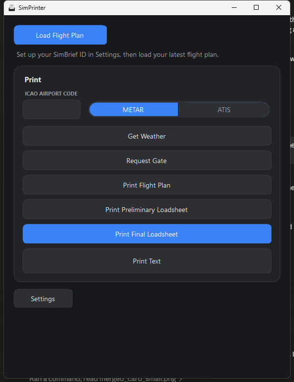
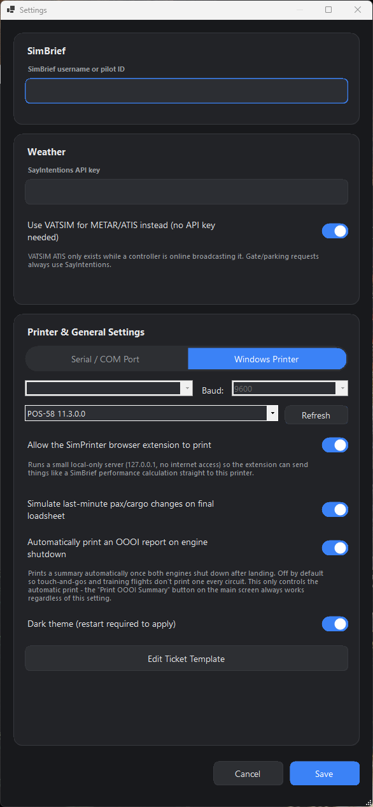
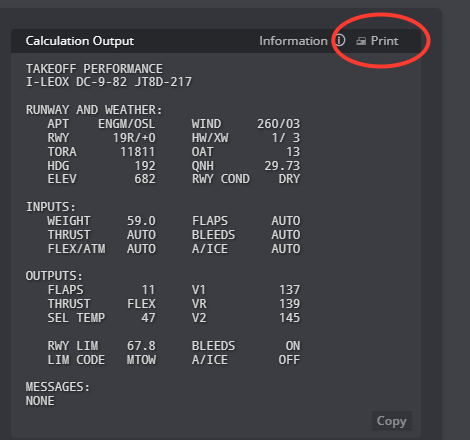

# SimPrinter

Pulls your SimBrief flight plan and prints it to a real receipt printer - flight plan,
loadsheets, weather, gate assignment, whatever. Built this because staring at a browser
tab for dispatch paperwork never felt right when you've got a working 58mm thermal
printer sitting on the desk doing nothing.

<p>
  
  
</p>

## What it does

Fetch your latest OFP from SimBrief and print a flight-plan ticket from a template you
can edit yourself (`Settings -> Edit Ticket Template`, plain text, no rebuild needed).
Preliminary and final loadsheets get generated from the same plan, and the final one can
throw in randomized last-minute pax/cargo changes if you want a bit of realism. If you've
got a [SayIntentions](https://sayintentions.ai/) key set up you can also pull METAR/ATIS
or a gate assignment and print those as ACARS-style tickets. Prefer VATSIM instead? Flip
"Use VATSIM for METAR/ATIS" on in Settings and it pulls real-world METAR plus live
controller-issued ATIS straight from VATSIM's network feed - no API key required (gate
requests still go through SayIntentions, since VATSIM has no equivalent).

There's a countdown in the footer to your scheduled off-block time, driven by SimConnect
reading the sim's actual Zulu clock rather than your PC's clock - matters if you fly with
time acceleration. And a "Print Text" box for pasting in anything else, like a takeoff
performance report copied out of SimBrief's calculator, since that data isn't exposed
through any API - or skip the copy/paste entirely with the [Firefox extension](#firefox-extension-simbrief-performance-print)
below, which adds a Print button right on SimBrief's own page.

Output goes either to a thermal printer over serial/COM, or to whatever's already
installed as a Windows printer. Dark mode's in there, and the window resizes down
reasonably for smaller screens.

## Installing

`SimPrinter-x.y.z.msi` from [Releases](../../releases). Self-contained, nothing else to
install.

## Building it yourself

You'll need Windows 10/11 64-bit and either Visual Studio 2022 (Community's free, grab
the .NET desktop development workload) or just the .NET 8 SDK on its own. Open
`SimPrinter.slnx` and hit F5, or:

```
dotnet build -c Release
```

A thermal printer isn't required to build or run the thing - you just won't have anything
to print to. If you've got one, it'll either show up as a COM port (USB or paired
Bluetooth SPP) or as a normal Windows printer through its driver.

One thing worth knowing: `src/SimPrinter/lib/SimConnect/` has Microsoft's SimConnect
client vendored in (the managed DLL, the native one it calls into, and the VC++
redistributable that native DLL needs) so the app can talk to the sim. These are
Microsoft's files, not mine, and they're not under this repo's MIT license - see the note
at the bottom of [LICENSE](LICENSE) if that matters to you. Same files ship with the free
MSFS SDK if you'd rather source them yourself.

## Using it

Open Settings, punch in your SimBrief username or pilot ID, optionally a SayIntentions API
key, and pick how you're printing (COM port + baud rate, or a Windows printer from the
dropdown). Back on the main screen, Load Flight Plan pulls the OFP, and the print buttons
light up once it's in.

A couple of printing gotchas if things don't work: for serial mode, double check the COM
port in Device Manager (Bluetooth printers need pairing first - they show up as an
"Outgoing" SPP port once paired). For Windows Printer mode, not every driver actually
passes raw ESC/POS bytes through - if it silently fails, serial is usually more reliable
for the no-name thermal printers since it skips the print spooler entirely. And if
characters come out garbled, it's probably a code page mismatch - output's CP437 by
default, which is the common one, but that's a one-line change in `EscPosBuilder.cs` if
your printer wants something else.

## Firefox extension: SimBrief Performance Print

SimBrief's takeoff/landing performance calculator doesn't expose its results through any
API, so short of copy-pasting into SimPrinter's Print Text box, there's no way to get a
V-speed strip onto paper automatically. This extension closes that gap: it adds a **🖨
Print** button directly onto SimBrief's calculator - both the per-flight popup and the
standalone [Performance & Tools](https://dispatch.simbrief.com/tools) page - and one click
sends the result straight to your printer.

<p>
  
</p>

It works by having SimPrinter run a small server on `127.0.0.1` (localhost only - nothing
outside your own machine can reach it, and it's off by default). The extension reads the
calculation text already sitting on the page and posts it there; SimPrinter reflows it to
fit your printer's width and prints it, the same way Print Text does.

### Installing it

1. In SimPrinter, open **Settings -> Printer & General Settings** and turn on **"Allow the
   SimPrinter browser extension to print"**, then Save.
2. Grab `simprinter-performance-print-signed.xpi` from [Releases](../../releases).
3. In Firefox, open `about:addons`, click the gear icon in the top right, choose
   **"Install Add-on From File..."**, and pick the `.xpi` you downloaded. (Dragging the
   file into a Firefox window works too.)

For now i only made a firefox addon, but if people would like i can make one for google chrome aswell, join the discord or send me a message on flightsi.to 

Once it's in, open a Takeoff or Landing Performance calculation on SimBrief and the Print
button shows up next to "Information" (or next to the Formatted/Raw Output toggle on the
standalone tools page). Source is in [`browser-extension/`](browser-extension/) if you'd
rather build and sign your own copy - see that folder's README for the details.

## Where things live

```
SimPrinter.slnx              Solution file - open this in Visual Studio
src/SimPrinter/
  SimPrinter.csproj           Project file
  Program.cs                  Entry point
  MainForm.cs / ConfigForm.cs / PastePrintForm.cs   UI
  UiStyle.cs                   Shared theming and custom-drawn controls
  SimBriefFlightPlan.cs        Flight plan data model + JSON parsing
  SimBriefClient.cs            Calls the SimBrief API
  SayIntentionsClient.cs       Weather/gate lookups
  SimConnectClient.cs          Reads the sim's Zulu clock via SimConnect
  LoadsheetGenerator.cs        Builds preliminary/final loadsheet values and tickets
  EscPosBuilder.cs             Builds ESC/POS byte sequences and ticket layouts
  TicketTemplate.cs            User-editable flight-plan ticket template
  PrinterService.cs            Sends bytes via COM port or the Windows print spooler
  LocalPrintServer.cs           Localhost server the browser extension prints through
  Preferences.cs               Settings persistence (%APPDATA%\SimPrinter)
  lib/SimConnect/               Vendored SimConnect client (see below)
installer/                    WiX installer source (build-installer.ps1 builds the MSI)
browser-extension/            Firefox extension - SimBrief Performance Print (see above)
assets/                       Logo and other non-code assets
```

## License

MIT, see [LICENSE](LICENSE) - except the vendored SimConnect files under
`src/SimPrinter/lib/SimConnect/`, which are Microsoft's own redistributables.
